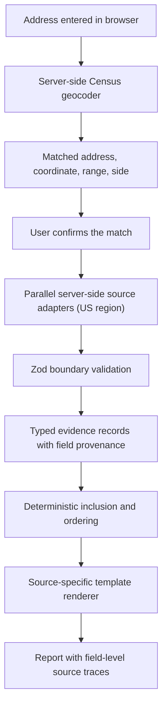

# Ground Truth

> Type a US address. Read what the public environmental record says about it. Click any sentence to open the government record behind it.

**Status:** Final brief, 2026-09-15. Source of truth for implementation.

Part A is what a judge reads. Part B is what we build. Part C is what we never say. Every endpoint, count, distance, and example address in this file was checked live on 2026-09-15 unless it is marked *unverified*.

---

## Part A. The product

### A1. The moment

You found a place. The listing shows the kitchen, the light, the commute. It does not show the refinery 750 metres east, the removal-action cleanup site 700 metres away, the ozone monitor whose summer readings are public, or the flood zone the block sits in.

All of that is public. It sits in six federal systems, each with its own search form and its own vocabulary, and none of them can be asked about one address across all six. Renters never look. Buyers pay a consultant to look.

Ground Truth asks all six about one address and returns one report. Every sentence in the report opens to show the agency, the record ID, the raw field, the date, and a link to the original record.

### A2. What the user sees

**Screen 1, search.** One address field. Three curated examples.

**Screen 2, confirm.** The matched address, the mapped point, and how precise it is.

> Matched: **9311 E AVE P, HOUSTON, TX, 77012.** The point sits on the 9301 to 9399 block, left side of the street segment, interpolated by the Census Geocoder. It marks the block, not the parcel.
>
> *Corrected 2026-09-16.* This is the sketch, and `origin/match@1` was written away from it on two counts. It renders:
>
> Matched: 9311 E AVE P, HOUSTON, TX, 77012. The point sits on the 9301 to 9399 block, street side L, interpolated by the Census Geocoder along TIGER line 96085986. It marks the block, not the parcel.
>
> The side prints as `L`, because that is what Census sends and expanding it to "left side of the street segment" would be this codebase inventing a vocabulary the source does not use — the same rule as B2's closing line. And the TIGER line is named, because it is the identifier a reader can take back to Census; the copy above drops it. `lib/templates/origin.ts` holds both arguments.

**Screen 3, report.** One card per source. Each card resolves on its own and shows its search boundary, its retrieval time, and its status. The cleanup card for that address, rendered by code from typed source fields:

> EPA's Superfund inventory (SEMS) lists **15 sites within 5 miles** of the mapped point. Nearest three:
>
> **RHODIA INC., ACID RELEASE**, 0.71 km. Not on the National Priorities List. Status: Removal Only Site (No Site Assessment Work Needed), as of 2012-06-12.
>
> **VALERO PLUME**, 0.76 km. Not on the National Priorities List. Status: Removal Only Site (No Site Assessment Work Needed), as of 2022-02-08.
>
> **KELLOGG TIRE FIRE**, 2.37 km. Not on the National Priorities List. Status: Removal Only Site (No Site Assessment Work Needed), as of 2026-06-22.
>
> Two sites on the final National Priorities List within 5 miles: **U.S. OIL RECOVERY**, 3.92 km, and **GENEVA INDUSTRIES/FUHRMANN ENERGY**, 6.84 km.
>
> *Corrected 2026-09-16.* The three record sentences are the copy `sems-site/summary@1` was deliberately written away from; this block is the shape, not the output. What it renders, from the committed bytes:
>
> RHODIA INC., ACID RELEASE, EPA ID TXN000607438. 0.71 km from the mapped point. NPL status: Not on the NPL. Non-NPL status: Removal Only Site (No Site Assessment Work Needed). Non-NPL status date: 2012-06-12.
>
> Four differences, each argued in `lib/templates/sems.ts`. The EPA ID is on the card, in a slot of its own, because the name is not an identifier a reader can take to EPA. The distance says what it is measured from, because `0.71 km` alone names no origin. Both statuses carry their own column's name, because `Status:` was a third name for `non_npl_status_name` sitting under an unlabelled `npl_status_name`, so the labelled one read as the site's status and the NPL one read as a remark. And the date is its own clause rather than an `as of` tail, because B10's "Date unavailable." is a standalone sentence and inlining it produced `as of Date unavailable.`
>
> One of the four is not a style difference. `Not on the National Priorities List` above is an expansion of what EPA sent, which is `Not on the NPL` — the string in `npl_status_name`, in `tests/fixtures/sems/envirofacts-TXN000622182.json`, and in the A3 trace panel's own row for it. B2's closing line forbids exactly that, and `tests/fixtures/README.md` says the same in its own words: status text is passed through verbatim and never mapped. The renderer prints `Not on the NPL`. The copy in this brief was the only place the expansion survived.
>
> The count sentence above these three and the final-NPL sentence below them are section templates rather than record ones, and this note is not about them.

The flood card for the Pasadena example address:

> The mapped point is in **zone AE**, inside the Special Flood Hazard Area. FEMA's FIRM study identifier for this area is 48201C. Read from Esri's reduced-set copy of FEMA's National Flood Hazard Layer, dated 2026-03-11.
>
> *Corrected 2026-09-16.* The earlier wording called `DFIRM_ID` a flood map panel. It is not: FEMA's own column description, carried in the recorded fixture, defines it as the study identifier for a FIRM database, identical for every polygon in the county. Panels live in `S_FIRM_Pan.FIRM_PAN` and look like `48201C0810L`. The block-not-parcel notice moved to the origin sentence, which carries the address range, street side and TIGER line that establish the interpolation; a FEMA template asserting it had no field behind it.
>
> *Corrected again, same day.* The `DFIRM_ID` half above still holds. The last sentence does not, and the move it records was reversed. Both FEMA templates now lead with the notice, and the card renders `The mapped point, a street-segment interpolation rather than a parcel boundary, is in zone AE, inside the Special Flood Hazard Area.` `lib/templates/fema.ts` argues the reversal under "On the parcel caveat": the zone clause is the only sentence in the product that asserts a hazard designation at a point, A5 requires a card to carry its limits on the card, and C2 forbids "Parcel-level flood risk", so the qualification belongs in the clause making the assertion rather than two screens earlier. The objection that a FEMA template asserting it had no field behind it was answered by the clause growing one: it carries the SFHA phrase as well as the zone letter, and the qualification is about that phrase at that point. Nothing was taken away to do it — the origin sentence still carries "It marks the block, not the parcel", and the adapter still carries the same caveat on the record, so a reader who arrives through a value rather than through the sentence gets it too.

The air card, shown as its template because values come from the monitor:

> Nearest PM2.5 monitor: {monitor}, {distance} km from the mapped point. {year} annual mean: {value} {unit}. The monitor measures its own location, not this address. AQS data lags collection by 6 months or more.

The facility card, shown as its template because ECHO field names are confirmed against the recorded fixture in slice 2:

> EPA ECHO lists {n} regulated facilities within 5 miles. {n} have a formal enforcement action on record. {n} are listed in current noncompliance. First: {facility}, {distance} km, {program}, last formal action {date}.

**Screen 4, trace.** Click any sentence.

### A3. Click any sentence

Clicking the VALERO PLUME sentence opens this panel. Every row is real data retrieved on 2026-09-15.

| Panel row | Content |
|---|---|
| Agency, record kind | EPA Superfund Enterprise Management System, site record |
| Record IDs | EPA ID `TXN000622182` · SEMS site `0622182` · FRS registry `110000460885` |
| Original record | https://cumulis.epa.gov/supercpad/cursites/csitinfo.cfm?id=0622182 |
| "VALERO PLUME" | Envirofacts `envirofacts_site.name` = `VALERO PLUME`, transform `identity`. FRS lists the same registry ID as `HOUSTON REFINERY` (`PRIMARY_NAME`). Both names shown. |
| "0.76 km" | `haversine` from the mapped point (29.720659, -95.261996) to the FRS coordinate (29.722274, -95.254401) = 755 m. Reference point: `CENTER OF A FACILITY OR STATION`. Accuracy value: not stated. |
| "Not on the National Priorities List" | `npl_status_name` = `Not on the NPL`, transform `identity` |
| "Removal Only Site (No Site Assessment Work Needed)" | `non_npl_status_name`, verbatim |
| "as of 2022-02-08" | `non_npl_status_date` = `2022-02-08 00:00:00`, transform `normalize-date` |
| Source updated | FRS `UPDATE_DATE` = `1710413511000`, transform `parse-epoch-ms` → 2024-03-14 |
| Retrieved | 2026-09-15, exact timestamp stamped at fetch time · adapter `sems@1` · SHA-256 of the response bytes |
| Caveats | A SEMS record can mean assessment, proposed action, active cleanup, or completed work. The coordinate is a reference point, not a boundary. |

No language model produced any row. The sentence exists because these fields exist. Delete the record and the sentence disappears. Change a field and the sentence changes. That is the property the tests in B12 enforce.

### A4. Why it is different

EPA publishes each of these systems separately. Listing sites show a proprietary risk score that cannot be opened to a government record. Environmental consultants sell the cross-system search as a report that costs thousands and takes weeks. Ground Truth:

- Puts six federal systems behind one address field, free.
- Keeps "holds a permit," "in noncompliance," "was fined," and "cleanup site" as four different statements. Most tools blur them into "polluter."
- Shows distance, date, and coordinate quality next to every value, so a reading from a monitor 30 km away never looks like a reading at the door.
- Lets the reader open every sentence to the raw field and the government page. The technical core: typed evidence records with field-level provenance, deterministic selection, and template rendering. No model writes a factual sentence.

### A5. What the report tells you it cannot do

Every card carries its limits on the card, not in a footer.

- The address point is a block interpolation, so the card says "block, not parcel."
- Monitors say how far away they are.
- A source that fails says "Source unavailable" and offers Retry. It is never quietly replaced.
- "No matching records" means exactly that. The word "safe" does not exist in the renderer.
- No score. Six sources with six meanings do not add to one number. A number would be the first thing a reader trusted and the last thing we could defend.

### A6. Three-minute demonstration

Run it on the deployed app, never on a laptop outside the US (see B1). Curated public, non-residential addresses, all geocoded and checked on 2026-09-15. ECHO and air cards for these addresses are confirmed from the US deployment in build step 0.

| Address | What it shows |
|---|---|
| 9311 E Ave P, Houston, TX 77012 | 15 SEMS sites within 5 miles, nearest at 0.71 km, two final-NPL sites at 3.92 km and 6.84 km, the block-not-parcel notice. |
| 400 N Richey St, Pasadena, TX 77506 | Final-NPL site U.S. OIL RECOVERY 183 m from the mapped point. FEMA zone AE, inside the Special Flood Hazard Area. |
| 1300 Perdido St, New Orleans, LA 70112 | FEMA zone X with subtype "Area With Reduced Flood Risk Due To Levee", outside the SFHA, shown verbatim. 19 SEMS sites within 5 miles. |
| 9400 Clinton Dr, Houston, TX 77029 | The Census Geocoder returns no match although EPA lists facilities at this address. The no-match state. |
| 100 Main St, Springfield | Candidates in several states. The disambiguation state. |

Beats:

1. Search 9311 E Ave P. Confirm the match. Point at the block-not-parcel line.
2. Cards resolve independently. The "sources responded" count ticks up.
3. Open the VALERO PLUME sentence. Walk the trace: both names, the distance formula, the status, the date, the record ID.
4. Click through to the EPA site profile. Same ID, same status.
5. Switch to 400 N Richey St. Show the NPL sentence and the zone AE sentence with the parcel caveat.
6. Revoke one key or block one host. One card says unavailable. The rest of the report stands.
7. Close with the government record open beside the sentence that rendered it.

Take an arbitrary address only after this has run.

### A7. Pitch

> The environmental record of a home is public and unreadable: six agency databases, six search forms, no way to ask about one address. Ground Truth asks all six and returns one report. Code renders every sentence from the agency's own fields, and every sentence opens to the raw field and the government record behind it.

Closing line:

> It will not score the home. It shows you what the record says, what the record cannot say, and where to look next.

---

## Part B. The build

### B1. Stack and where it runs

- Next.js App Router. Server-only source adapters. Zod at every external boundary. Native `fetch` with `AbortController`. Streamed per-source results. Vitest for adapters, renderer, and policy. Playwright for the address-to-trace path.
- Keys live only in server environment variables. AQS and AirNow keys never reach the browser.
- **One host is unreachable, not two.** Corrected 2026-09-16. ECHO was assumed to refuse non-US traffic after it reset the stream on several attempts. It does not. It is slow and flaky to open, and it answers once the request carries retries and a longer timeout. Every ECHO payload in `tests/fixtures/echo/` was recorded from this machine. FEMA's NFHL host (`hazards.fema.gov`) genuinely does reset the TLS handshake before any HTTP exchange, from every route tried, and retries do not help. Only that one needs a US-reachable host, and `scripts/capture-us-fixtures.sh` captures it.
- Build step 0 deploys a probe route to the chosen region and calls ECHO `echo_rest_services.metadata` and NFHL layer 28. If either rejects the deployment's egress, the fallbacks in B2 apply and the card names the dataset it used.
- Fixtures are recorded by a CI job on a US runner and committed under the test directory.

### B2. Sources

| Source | Product use | Endpoint | Access | Verified facts and quirks |
|---|---|---|---|---|
| US Census Geocoder | Address to point | `geocoding.geo.census.gov/geocoder/locations/onelineaddress`, benchmark `Public_AR_Current`, JSON | None | Reachable worldwide. Returns `matchedAddress`, `coordinates`, `tigerLine.{tigerLineId,side}`, and `addressComponents.{fromAddress,toAddress}`. **No match-type field exists.** Precision is expressed as the address range and street side. Vague input returns several candidates across states. Some real addresses return none. |
| EPA ECHO | Regulated facilities, compliance, enforcement | `echodata.epa.gov/echo/echo_rest_services.get_facilities` with `p_lat`, `p_long`, `p_radius` (miles) and `qcolumns`, then `get_qid` pages | None | Verified and fixtured. **Send `qcolumns` or there is no longitude.** `FAC_LONG` is column 18 of ECHO's own metadata and is absent from the default response while `FacLat` is present, so every facility would arrive with no computable distance. Every value is a string, including coordinates and a penalty of `"$0"`. Dates are month/day/year. The first call says `Message: "Success"`, the second says `"Working"`, and neither means failure. Zero rows with `Success` is the no-data case. Errors arrive at HTTP 200 as `Results.Error.ErrorMessage`, a different shape from ArcGIS's. Slow: needs retries and a timeout far longer than the default. |
| EPA FRS | Facility identity, program IDs, coordinate quality | ArcGIS layer `FRS_INTERESTS` on `services.arcgis.com/cJ9YHowT8TU7DUyn`, query by `REGISTRY_ID` or by point plus `distance`; REST `frs-public.epa.gov/ords/frs_public2/frs_rest_services.get_facilities` (`search_radius` in miles) | None | Reachable worldwide. One row per program interest with `PGM_SYS_ID`, `PGM_SYS_ACRNM`, `INTEREST_TYPE`, `ACCURACY_VALUE`, `COLLECT_MTH_DESC`, `REF_POINT_DESC`, `UPDATE_DATE` (epoch ms). 2,000 rows per page. 6,915 interest rows within 5 miles of the Houston test point, so FRS is an identity lookup, not a list. Data edited 2026-09-14. |
| EPA SEMS | Superfund assessment and cleanup sites | ArcGIS layer `FRS_INTERESTS_SEMS` (same org) for radius search; Envirofacts `data.epa.gov/efservice/envirofacts_site/epa_id/{EPA_ID}/JSON` for status, status date, archived flag, SEMS site ID; profile `cumulis.epa.gov/supercpad/cursites/csitinfo.cfm?id={site_id}` | None | Reachable worldwide. The table names behind EPA's older SEMS links no longer exist. Envirofacts has no radius query and its coordinate is sometimes null or differs from FRS (Rhodia: 10 km apart). Distance uses the FRS coordinate; a differing SEMS coordinate is shown in the trace. FRS name and SEMS name differ for the same site. 55,632 sites nationally, 40,823 archived. |
| EPA AQS | Historical PM2.5 and ozone monitor summaries | `aqs.epa.gov/data/api/monitors/byBox`, `annualData/byBox`, `dailyData/byBox`; params `88101` PM2.5, `44201` ozone | Free key by email | Docs verified. 10 requests per minute, 5-second pause requested. Begin and end dates must fall in one year except for `monitors`. Data can lag 6 months or more. The shared test account is capped daily and was exhausted on 2026-09-15. |
| AirNow | Current preliminary conditions | `airnowapi.org/aq/observation/latLong/current` | Free key | Returns 401 without a key. Observations update hourly. Rate limits are documented behind login. *Response shape unverified until a key exists.* |
| FEMA NFHL | Flood zone at the point | Authoritative: `hazards.fema.gov/arcgis/rest/services/public/NFHL/MapServer/28/query`, point intersect, fields `FLD_ZONE`, `ZONE_SUBTY`, `SFHA_TF`, `DFIRM_ID`, `FLD_AR_ID`, `SOURCE_CIT`. Fallback: Esri "USA Flood Hazard Areas" reduced set, `services.arcgis.com/P3ePLMYs2RVChkJx/.../USA_Flood_Hazard_Reduced_Set_gdb/FeatureServer/0` | None | NFHL host refuses non-US traffic. Fallback verified: no token, same field names, data dated 2026-03-11, but it contains only hazard classes (A, AE, AH, AO, A99, V, VE, D, shaded X, floodway, levee). **Unshaded zone X is absent, so an empty fallback result cannot be rendered as "no digital coverage."** |

Reachability from the dev machine on 2026-09-15 (India egress):

| Host | Result |
|---|---|
| `enviro.epa.gov`, `hazards.fema.gov`, `msc.fema.gov` | Refused |
| `echodata.epa.gov` | Recorded as Refused on 2026-09-15. **Corrected 2026-09-16: reachable.** It resets the stream on the first attempts and answers once the request carries retries and a longer timeout. The seven payloads in `tests/fixtures/echo/` were recorded from this machine. See B1 and the two ECHO rows in B14. |
| `geocoding.geo.census.gov`, `data.epa.gov`, `frs-public.epa.gov`, `aqs.epa.gov`, `airnowapi.org`, `services.arcgis.com`, `cumulis.epa.gov`, `echo.epa.gov` (site only) | OK |

Local development therefore runs Census, SEMS, FRS, ECHO and the Esri flood layer live; runs AQS and AirNow live the moment the operator's key exists, and answers `not-configured` until then; and has no source at all for FEMA's authoritative NFHL layer, so the Esri copy answers in its place and every record says so in its own sentence.

*Corrected 2026-09-16.* This paragraph read: "Local development therefore runs Census, SEMS, FRS, AQS, AirNow, and the Esri flood layer live, and runs ECHO and NFHL from recorded fixtures with the replay label from B11." Both halves of the second clause are wrong. ECHO is reachable, per the table above. And there is no replay path to run anything from: `Recorded demonstration` and `replay` match nothing under `lib/`, `app/`, `scripts/` or `tests/`, and `app/api/report/route.ts` wires the handler to `createFetchSourceIo()` behind the B9 cache and to nothing else, so every source on the report path is a live fetch. The recorded fixtures are read by the test suite only, and a test proves production code cannot import them. A sentence saying the running application serves a source from fixtures is the one claim this project's whole premise cannot afford to get wrong, and it stood here for a day.

Search boundaries are display boundaries, not health thresholds:

| Record class | Boundary | Display rule |
|---|---:|---|
| ECHO facilities and records | 5 miles | Total count, then the first five by the B7 order. "View all" for the rest. |
| SEMS sites | 5 miles | Total count, then the first five by distance. NPL sites named in a separate sentence. |
| FRS | 5 miles for the count only | Used to resolve identity and coordinate quality for ECHO and SEMS records. The count is shown as context. No list. |
| AQS monitors | 50 km | Nearest qualified PM2.5 monitor and nearest qualified ozone monitor. No result when none qualifies. |
| AirNow | Source-defined reporting area | The reporting area or monitor location AirNow returns. |
| FEMA | Exact mapped point | Every polygon that intersects the point, with the dataset that answered. |

Unknown source statuses are preserved verbatim. The application does not guess their meaning.

### B3. Data flow



No language model calls a data source or writes a factual sentence.

### B4. Evidence types

Source-specific variants. No generic bag of strings. Field comments name the verified source field.

```ts
type SourceId = "census" | "echo" | "frs" | "sems" | "aqs" | "airnow" | "fema";

type JsonValue = null | boolean | number | string | JsonValue[] | { [key: string]: JsonValue };

type Transform =
  | "identity"
  | "parse-number"
  | "normalize-date"      // "2022-02-08 00:00:00" -> "2022-02-08"
  | "parse-epoch-ms"      // 1710413511000 -> "2024-03-14T10:51:51Z" (ArcGIS layers)
  | "normalize-distance"
  | "normalize-unit"
  | "normalize-pollutant"
  | "join-fields"
  | "map-boolean"         // SFHA_TF "T" -> true
  | "haversine";

type Provenance = {
  sourceField: string;
  rawValue: JsonValue;
  transform: Transform;
  adapterVersion: string;
};

type Sourced<T> = { value: T; provenance: readonly [Provenance, ...Provenance[]] };

// A record can be built from more than one response. SEMS joins the ArcGIS
// layer to Envirofacts, so a single hash per record cannot be honest.
type PayloadRef = { dataset: string; url: string; sha256: string; retrievedAt: string };

type GeoPoint = {
  latitude: Sourced<number>;
  longitude: Sourced<number>;
  accuracyMeters: Sourced<number | null>;    // FRS ACCURACY_VALUE
  collectionMethod: Sourced<string | null>;  // FRS COLLECT_MTH_DESC
  referencePoint: Sourced<string | null>;    // FRS REF_POINT_DESC
};

type EvidenceBase = {
  id: string;
  source: SourceId;
  sourceRecordId: string;
  sourceUrl: string;
  subject: Sourced<string>;
  location: GeoPoint | null;
  distanceMeters: Sourced<number> | null;    // always "haversine" with both coordinates in provenance
  effectiveAt: Sourced<string | null>;
  sourceUpdatedAt: Sourced<string | null>;
  payloads: readonly [PayloadRef, ...PayloadRef[]]; // one per response the record was built from
  caveats: string[];
};

type GeocodeMatch = {
  kind: "census-match";
  source: "census";
  matchedAddress: Sourced<string>;           // matchedAddress
  point: GeoPoint;                           // coordinates.y, coordinates.x; accuracy fields null
  addressRange: Sourced<{ from: string; to: string }>; // addressComponents.fromAddress/toAddress
  tigerLineId: Sourced<string>;              // tigerLine.tigerLineId
  streetSide: Sourced<string>;               // tigerLine.side
  candidateCount: number;                    // addressMatches.length
  retrievedAt: string;
  rawPayloadHash: string;
};

// ECHO field names are fixed in slice 2 from the recorded fixture bytes.
type EchoFacilityRecord = EvidenceBase & {
  kind: "echo-facility";
  source: "echo";
  frsRegistryId: Sourced<string | null>;
  programIds: Sourced<string[]>;
  officialStatus: Sourced<string | null>;
};

type EchoComplianceRecord = EvidenceBase & {
  kind: "echo-compliance";
  source: "echo";
  facilityRecordId: Sourced<string>;
  program: Sourced<string>;
  officialComplianceStatus: Sourced<string>;
  periodStart: Sourced<string | null>;
  periodEnd: Sourced<string | null>;
};

type EchoEnforcementRecord = EvidenceBase & {
  kind: "echo-enforcement";
  source: "echo";
  facilityRecordId: Sourced<string>;
  actionType: Sourced<string>;
  caseStatus: Sourced<string>;
  actionDate: Sourced<string | null>;
  penaltyAmountUsd: Sourced<number | null>;
};

type FrsFacilityRecord = EvidenceBase & {
  kind: "frs-facility";
  source: "frs";
  registryId: Sourced<string>;               // REGISTRY_ID
  programInterests: Sourced<Array<{
    program: string;                         // PGM_SYS_ACRNM
    programId: string;                       // PGM_SYS_ID
    interestType: string | null;             // INTEREST_TYPE
    activeStatus: string | null;             // ACTIVE_STATUS
  }>>;
};

type SemsSiteRecord = EvidenceBase & {
  kind: "sems-site";
  source: "sems";
  epaSiteId: Sourced<string>;                // PGM_SYS_ID / epa_id, e.g. TXN000622182
  semsSiteId: Sourced<string | null>;        // envirofacts_site.site_id, e.g. 0622182
  frsRegistryId: Sourced<string | null>;     // REGISTRY_ID
  frsName: Sourced<string>;                  // PRIMARY_NAME
  semsName: Sourced<string | null>;          // envirofacts_site.name
  interestType: Sourced<string>;             // INTEREST_TYPE, verbatim
  nplStatus: Sourced<string>;                // npl_status_name, verbatim
  nonNplStatus: Sourced<string | null>;      // non_npl_status_name, verbatim
  statusDate: Sourced<string | null>;        // non_npl_status_date, normalize-date
  archived: Sourced<boolean | null>;         // archived_ind, map-boolean
  semsCoordinate: GeoPoint | null;           // Envirofacts coordinate; shown in trace when it differs from location
};

type AqsMonitorSummaryRecord = EvidenceBase & {
  kind: "aqs-monitor-summary";
  source: "aqs";
  monitorId: Sourced<string>;
  pollutant: Sourced<"PM2.5" | "Ozone">;
  period: Sourced<string>;
  statistic: Sourced<string>;
  value: Sourced<number>;
  unit: Sourced<string>;
};

type AirNowObservationRecord = EvidenceBase & {
  kind: "airnow-observation";
  source: "airnow";
  reportingArea: Sourced<string>;
  pollutant: Sourced<"PM2.5" | "Ozone">;
  observedAt: Sourced<string>;
  aqi: Sourced<number | null>;
  category: Sourced<string | null>;
  concentration: Sourced<number | null>;
  unit: Sourced<string | null>;
};

type FemaFloodZoneRecord = EvidenceBase & {
  kind: "fema-flood-zone";
  source: "fema";
  dataset: Sourced<"NFHL" | "ESRI_REDUCED_SET">;
  zoneCode: Sourced<string>;                 // FLD_ZONE
  zoneSubtype: Sourced<string | null>;       // ZONE_SUBTY
  specialFloodHazardArea: Sourced<boolean | null>; // SFHA_TF, map-boolean
  firmPanelId: Sourced<string | null>;       // DFIRM_ID
  floodAreaId: Sourced<string | null>;       // FLD_AR_ID
  sourceCitation: Sourced<string | null>;    // SOURCE_CIT
};

type EvidenceRecord =
  | EchoFacilityRecord
  | EchoComplianceRecord
  | EchoEnforcementRecord
  | FrsFacilityRecord
  | SemsSiteRecord
  | AqsMonitorSummaryRecord
  | AirNowObservationRecord
  | FemaFloodZoneRecord;
```

Each variant has a literal `kind` and only the fields valid for that source. The adapter version identifies the parser. The trace stores the fields and raw values needed to explain displayed output. Production does not expose the full raw payload by default.

### B5. Boundary validation

Each adapter, in order:

1. Fetch the source response on the server.
2. Parse the raw response with a source-specific Zod schema.
3. Reject a malformed response as a source failure.
4. Preserve unknown status codes as source text.
5. Normalize coordinates, dates, values, and units.
6. Attach field-level provenance.
7. Return one or more source-specific `EvidenceRecord` values.

Business logic receives validated records only. It never reads raw API objects.

### B6. Facility grouping

The application groups related records. It does not claim that inferred matches are one legal or physical facility.

1. An exact FRS registry ID creates a confirmed group. Verified example: PASADENA REFINING SYSTEM, INC. appears as two SEMS EPA IDs (`TXN000607355`, `TXN000605303`) under one registry ID `110000462703`.
2. An exact program ID creates a confirmed program link.
3. Similar names and nearby coordinates create a suggested group, labelled "Possible match."
4. When two sources give different coordinates for one record, distance uses the FRS coordinate and the trace shows both.

Every grouped record keeps its original source ID, both names, coordinate, and link.

### B7. Deterministic inclusion and ordering

The full report retains every record inside the visible boundary. Nothing can remove a record.

The summary always shows: matched-address precision; the status of every source; the FEMA result or FEMA no-polygon state with its dataset; the AirNow result or no-data state; the nearest qualified AQS monitor per pollutant; ECHO and SEMS counts before records; up to five ECHO and five SEMS records; "View all" when a section holds more.

ECHO order: records with a formal enforcement action; then records in current noncompliance; then by distance; ties by newest first. SEMS order: by distance, with NPL sites also named in their own sentence. No invented severity order. Unknown values sort after known values and stay visible.

### B8. Rendering and trace

Each `kind` has an allowlist of templates. A template accepts only fields of its record type. Example:

```text
{semsName}, {distance}. {nplStatus}. Status: {nonNplStatus}, as of {statusDate}.
```

Rules: every slot receives a `Sourced<T>` or an explicit calculation; a template cannot render the wrong kind; a missing field removes its clause; nothing is guessed; calculated distances carry both coordinates and the formula; a removed record leaves no text; the renderer has no path that emits "safe," "unsafe," or an equivalent verdict.

The trace panel shows: agency; record kind; source record ID; original link; raw field name and raw value per displayed value; normalized value; transform and adapter version; record date, source-update date, retrieval date; distance inputs and formula; source caveats.

### B9. Address and privacy lifecycle

1. The browser sends the raw address to the server geocoding route.
2. The server forwards it to the Census Geocoder over HTTPS.
3. The server returns the matched address, coordinate, range, side, and candidate count.
4. The user confirms or picks a candidate.
5. The browser sends the confirmed coordinate and match metadata to the report route.
6. Environmental adapters receive coordinates and query parameters only.
7. The report lives in browser memory and disappears with the page session.

No accounts. No database of searches or reports. No analytics that capture addresses or coordinates. No raw addresses or coordinates in logs or error payloads. No cache key tied to a user, session, IP, or browser.

Bounded in-memory coordinate cache: AirNow 10 minutes; geocoder none; ECHO, FRS, SEMS, AQS, FEMA 60 minutes. The cache dies with the process. Expired data never renders as current.

### B10. Failure behavior

| Failure | User-visible result |
|---|---|
| No address match | "The Census Geocoder found no match. Enter the street number, street, city, state, and ZIP." Verified example: 9400 Clinton Dr, Houston, TX 77029 returns no match. |
| Ambiguous match | Candidate list. A choice is required. |
| Source host refuses the server's region | "Source unavailable" with Retry. Internal alert. Never a fixture. |
| Source timeout | "Source unavailable" with Retry. |
| Malformed response | "Source unavailable." Schema error logged without user data. |
| Rate limit | Retry time when the source states one. AQS is 10 requests per minute. |
| No matching records | "No matching records within the stated boundary." |
| Missing record date | "Date unavailable." |
| Distant air monitor | Distance next to every value. |
| FEMA, NFHL answered, no polygon | "No digital FEMA designation was available at this point." Confirm from the US region that NFHL returns minimal-hazard polygons where mapped. |
| FEMA, Esri reduced set answered, no polygon | "No 1% or 0.2% flood hazard polygon intersects this point in the Esri copy of FEMA's layer, dated 2026-03-11. This copy omits minimal-hazard areas, so it cannot tell minimal hazard from an unmapped area." |
| Unknown source status | Verbatim, with "Meaning not mapped." |
| Expired cache entry | Fetch live or mark unavailable. |

Every source has an independent timeout and retry policy. No source blocks the report.

### B11. Fixtures and replay

Recorded fixtures live only under the test directory. Production code cannot import them. A CI job on a US runner records ECHO and NFHL responses for the curated addresses and commits the exact bytes.

A demo-replay build may use recorded responses only when the card displays "Recorded demonstration," the recording date, and the source. The live application never replaces a failed source with a fixture.

*Noted 2026-09-16.* No such build exists and nothing implements this. `Recorded demonstration` and `replay` match nothing under `lib/`, `app/`, `scripts/` or `tests/`, and there is no fixture-backed io on the report path. This is a rule kept for a build nobody has made, not a description of one — read it that way, and do not take a reference to "the replay label from B11" elsewhere in this document as evidence the path is there.

### B12. Tests

Adapter tests, per source, from recorded fixtures: success; no records; missing optional fields; unknown status; malformed response; rate limit; timeout. Assertions are literal normalized records, including units, timestamps, IDs, and provenance.

Rendering tests attempt to: use the wrong template for a record; insert a field the type does not own; change a normalized value after validation; remove the record after rendering; create a sentence without provenance; change a number, date, distance, unit, status, or name. The renderer rejects the input or regenerates only from the current record.

Selection tests prove: every source status appears; mandatory records cannot be omitted; ECHO order follows B7; SEMS order follows distance; more than five records yields a correct total and "View all."

Privacy tests prove: environmental adapters never receive the raw address; logs redact addresses and coordinates; client bundles contain no keys; fixtures cannot enter a production build; cache entries carry no user or session identifier.

Playwright drives: a precise match; an ambiguous match; a no-match; a SEMS result with trace to raw field; an ECHO enforcement result; a FEMA polygon and a FEMA no-polygon state, each naming its dataset; a distant monitor; one failed source with a usable report.

### B13. Build sequence

0. **Hour one, in parallel.** Deploy a probe route to the US region and call ECHO metadata and NFHL layer 28. Add the CI recorder job. Register AQS and AirNow keys.
1. **Slice 1, SEMS.** Recorded ArcGIS and Envirofacts responses for 9311 E Ave P. Zod schemas. `SemsSiteRecord` with provenance. Distance ordering. One template. One card. One trace panel. Mutation tests. Done when the VALERO PLUME sentence traces to raw fields and every altered value fails a test. SEMS goes first because every path is reachable from the dev machine today.
2. **Slice 2, ECHO.** Same pipeline from the CI-recorded fixture. The Zod schema is derived from the recorded bytes. Facility and enforcement records. The B7 order.
3. Live Census geocoding and the confirmation state, including range, side, candidates, and no-match.
4. Live SEMS and FRS grouping by registry ID.
5. Live ECHO from the US region.
6. FEMA: NFHL from the US region, Esri fallback with its own dataset label and wording.
7. AQS historical monitor data.
8. AirNow current conditions.
9. Partial-result and privacy tests.
10. The curated address set through the deployed application.

No new source until the current one passes its adapter, rendering, failure, and trace tests.

### B14. Verification log, 2026-09-15, corrected and extended 2026-09-16

| Check | Result |
|---|---|
| Census, 1600 Pennsylvania Ave NW | Match. Range 1600 to 1648, side L, TIGER line 76225813. No match-type field. |
| Census, 100 Main St, Springfield | Multiple candidates, MA and VT among them. |
| Census, 9400 Clinton Dr, Houston | No match. |
| ECHO REST, first attempts | Stream reset, timeout, 502. **This conclusion was wrong.** |
| ECHO REST, with retries and a 120s timeout | Answers. Seven payloads recorded, including the zero-rows case and an error envelope. |
| ECHO, longitude | `FacLong` absent from the default response, present in the metadata as column 18, returned once `qcolumns` asks for it. |
| ECHO, 5 miles from 9311 E Ave P | 1,686 facilities, $20,254,146 in total penalties, 40 formal enforcement actions. |
| FEMA NFHL host, every route tried | TLS handshake reset, with and without retries. Genuinely unreachable from here. |
| Envirofacts join rate, all 15 Houston layer sites | 15 of 15 have a status row. A missing row is rare, not common. |
| FRS, registry 110000460885 | 38 programme-interest rows across 15 programmes, 14 distinct update dates, one facility. |
| Esri flood layer, three points | New Orleans CBD: X, 0.2% annual chance. Meyerland: AE, SFHA. Houston Ship Channel: no polygon. **The New Orleans subtype is wrong. Corrected 2026-09-16.** The committed response for that point, `tests/fixtures/fema/esri-zone-x-levee-neworleans.json`, carries `FLD_ZONE: "X"`, `SFHA_TF: "F"` and `ZONE_SUBTY: "Area With Reduced Flood Risk Due To Levee"` — a levee subtype, not a 0.2% annual chance one. A6 row 3 states the levee subtype for the same address and the bytes agree with A6, so this row is the one that drifted. The zone letter and the outside-the-SFHA answer here are right; only the subtype was misrecorded, and it is the one verbatim agency string the demonstration puts on screen for that address. |
| Esri flood layer, distinct classes | A, A99, AE, AH, AO, D, V, VE, X (shaded only). |
| FRS REST, 2-mile radius at the Houston test point | 467 facilities. Farthest 3.219 km, so the unit is miles. |
| FRS ArcGIS layer, 5-mile radius | 6,915 interest rows. |
| FEMA `DFIRM_ID`, from the recorded fixture's own field descriptions | Study identifier for a FIRM database, not a map panel, and identical across the county. A2 corrected 2026-09-16. |
| FEMA `SOURCE_CIT`, same source | An abbreviation that must match a row in `L_Source_Cit`. A lookup key, not a citation. |
| FEMA `SFHA_TF`, same source | "If the area is within a SFHA this field would be true." True for any A or V zone, false for X or D. |
| AQS shared test account, 2026-09-16 | Still exhausted. HTTP 429, `Retry-After: 86400`, body `{"error":"Daily limit for account use exceeded. Retry later."}`. Recorded as `tests/fixtures/aqs/rate-limited.json`. |
| AirNow without a key, 2026-09-16 | HTTP 401, body `{"WebServiceError":[{"Message":"Request not authenticated."}]}`. So its error envelope is `WebServiceError`, an array of `{Message}`. Recorded as `tests/fixtures/airnow/unauthenticated.json`. Its success shape is still unverified. |
| AQS response envelope, from EPA's own published API documentation | `{"Header":[{status,request_time,url,rows}],"Body":[...]}`. It is `Body`, not `Data`. Documentation reachable from this machine; no success payload has been recorded. |
| SEMS ArcGIS layer, 5-mile radius | Houston Ship Channel test point (29.7355, -95.2615): 19 records in about one second, 2 on the final NPL, 1 part of an NPL site. 9311 E Ave P: 15 records, 2 on the final NPL. |
| SEMS Envirofacts join by EPA ID | Status name, status date, archived flag, SEMS site ID returned. |
| SEMS profile link format | `cumulis.epa.gov/supercpad/cursites/csitinfo.cfm?id=0622182` returns the VALERO PLUME page. |
| AQS docs | 10 requests per minute. Same-year date windows except `monitors`. 6-month or longer lag. Test account exhausted. |
| AirNow | 401 without key. Hourly updates. |

---

## Part C. Guardrails

### C1. Out of scope for the first version

International data. Active-fire detection. Community air sensors. A cumulative score. Personal exposure estimates. Predictive flood, health, or property models. Accounts and saved searches. GPS, camera, voice, and listing-URL input. Free-form factual text from a language model. AI-generated causal explanations. Web-search claims. Public allegations.

### C2. Words that never appear

"Operating polluters near your home." "Any US address." "Parcel-level flood risk." "No records means safe." "The AI cannot hallucinate." "Personal exposure." "Real-time environmental history." "Every source is complete and correct." "Likely cause" without a source that establishes causation. A cumulative risk score. A self-assigned judging score. Any claim about competing submissions.

### C3. Repository hygiene before judging

`IDEA.md` is the earlier revision and still contains "operating polluters," "any US address," an Opus synthesizer, NASA FIRMS, OpenAQ, and "use my location." `DATA-TESTS.md` is the Bangalore flood test from the international idea. Replace `IDEA.md` with this file, archive `DATA-TESTS.md`, and put Part A in the README.
